# Basics
Django is an open source framework for creating web aplicatons using Python
 . <br>
Django allows you to create web applications quickly, simplifying a large number of repetitive tasks.
It allows you to:
- Use a database.
- Authenticate users.
- Create forms.
- Manage the security of your application.
- Have an administration panel already created.

# Installation/Requirements
This project will be done using the WSL2 Ubuntu-20.04 environment, Python 3.10.9 through a virtual environment.

```bash
nivek@YEFF:~/django_basics$ virtualenv --python=python3.10.6 venv
```
```bash
nivek@YEFF:~/django_basics$ source venv/bin/activate
(venv) nivek@YEFF:~/django_basics$ python3.10 --version
Python 3.10.9
```

## Django (Installation)
I will use Django 4.1
```bash
(venv) nivek@YEFF:~/django_basics$ pip install django==4.1
(venv) nivek@YEFF:~/django_basics$ django-admin --version
4.1
```
# Create your first project with Django!
In order to start your project you should use the following command:
```bash 
(venv) nivek@YEFF:~/django_basics$ django-admin startproject my_project
```
Or u can use the dot symbol to avoid the creation of a second folder with the same name of your project.
```bash
(venv) nivek@YEFF:~/django_basics$ django-admin startproject my_project .
```
Now in the root of your project you will have the following files:
<p align="center">

|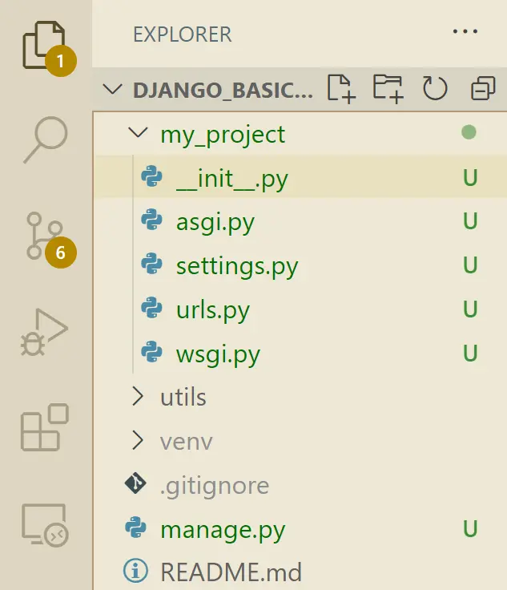|
| :---: |
|_The files shown in the image are the basic files that are created when a new Django project is created._|

</p>

> **_NOTE:** Remember that a project in Django is a high-level container, which hosts one or more applications, it also contains all the directories and files necessary for the application(s) to function properly

## Launch your project

To start your project we must take into account the file <span style="color:red;">`manage.py`</span>, this file is a script that is used to manage your Django project, this script can be used to create applications, create databases, run tests and much more.<br>
<br>So let's run the following command:

```bash
(venv) nivek@YEFF:~/django_basics$ python3 manage.py runserver
```

<p align="center">

  |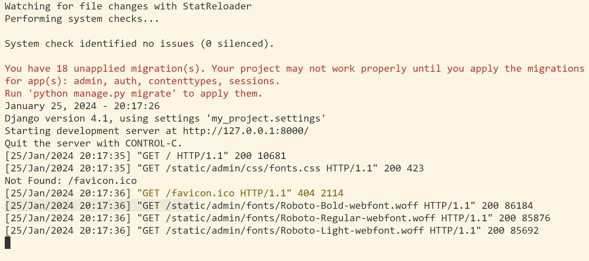|
  | :---: |
  |_Let's take a look at the server on which our project is running._|
  |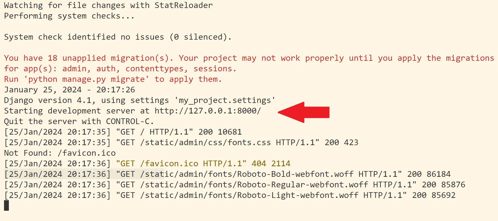|
  |_Click the link._|
  |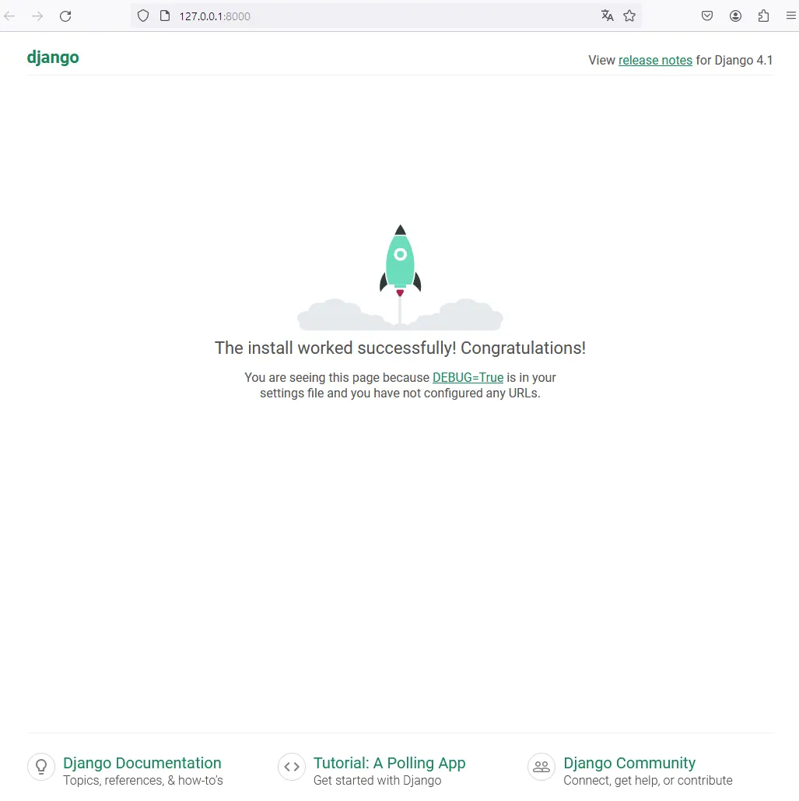|
  |_Let's take a look at our first project!_|

</p>

As you can see our project is running at `http://127.0.0.1:8000/` <br>
Now the installation has now been successfully completed!

> Note: Remember that when executing the command you can change the port on which our project will be executed.

# Project structure

After executing the command to start a project with Django you will see a series of new files have appeared these (already seen previously), let's make a brief tour of these initial files.

- <span style="color:red;">`manage.py`</span>: This file is a script used to manage your Django project. This script can be used to build applications, create databases, run tests and much more.<br>
  For example the command we use to run our application or create the development environment: 
  ```bash
  (venv) nivek@YEFF:~/django_basics$ python3 manage.py runserver
  ```
  You can see this and other commands by executing the following command:
  ```bash
  (venv) nivek@YEFF:~/django_basics$ python3 manage.py --help
  ```
  <p align="center">

  |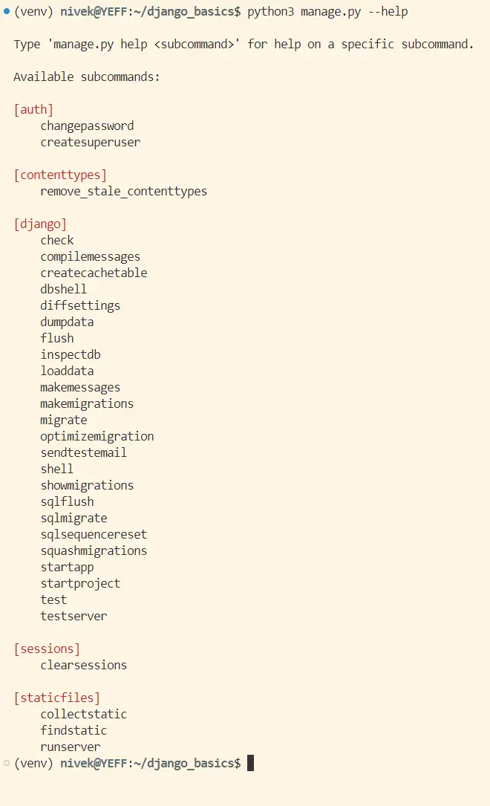|
  |:---:|
  </p>
  Great, isn't it?

- <span style="color:red;">`db.sqlite3`</span>: It is a SQLite database that is created by default when executing the `django-admin startproject` command,
  it is used to store the data of your Django project and if necessary it can be changed to another database.

### Inside /my_project

- <span style="color:red;">`__init__.py`</span>: This is a special file that tells Python that this folder is a Python package. 
  A Python package is a collection of Python files that can be imported as a whole.

- <span style="color:red;">`asgi.py, wsgi.py`</span>: Both ASGI and WSGI are server interfaces that allow serving and running web 
  applications created with Django since these modules are better at performing this task while Django takes care of the application logic.

- <span style="color:red;">`settings.py`</span>: Roughly speaking, this file will contain the information and global configuration of the project, 
  this configuration includes things like database, secret keys, templates, password validation, the path to the folder where our static files 
  will be located, etc.

- <span style="color:red;">`urls.py`</span>: The urls.py file is one of the most important configuration files in a Django project. 
  It is responsible for mapping the application's URLs or paths to the views that handle incoming requests, it also allows the separation 
  between routing logic and views, keeping all URL routing centralized in one place.

### Flowchart

<p align="center">

|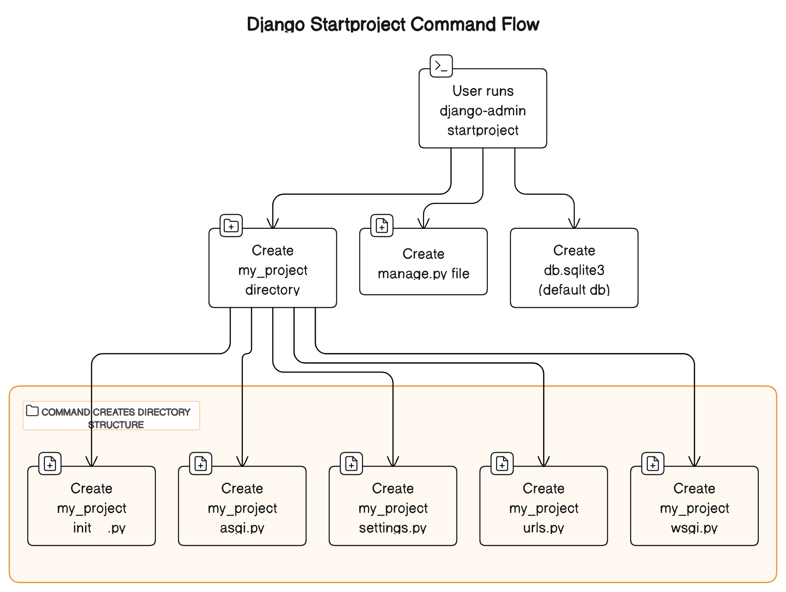|
|:---:|
</p>

# How to create an App with Django

In order to create an app we need to execute the following command:

```bash
venvnivek@YEFF:~/django_basics$ python3 manage.py startapp my_app
```

### Inside /my_app
- `_init_.py`: As the previous explanation it is a especial file that tells to Python that this folder is a Python package.
- `my_app/migrations`: It plays a fundamental role in Django's migration system, facilitating secure and controlled changes to the database, These changes are made automatically when we apply changes to the models of our application, thus allowing them to be synchronized.
- `admin.py`: Ths file allows us to register models in to the damin panel, giving you a graphical interface to manage app's data efficiently, the admin panel offers basic CRUD functionality as well as costomization options to tailor the admin experience to our specific needs.
- `apps.py`: A configuration file equivalent to `settings.py` from the project.
- `models.py`: This file is used to create classes that will later be converted into SQL tables, te important thing here is that Django will take care of that transition and will also do it when changes are made into the models, to achieve this Django will create migration files these will be reflected in the `my_app/migrations` folder.
- `views.py`: This file contains python functions that takes http requests and returns http response, like HTML documents.

## Your first Hello World! with Django

In order to perform this famous function but using Django, we must ake into
account the following fies from both the application and the project,
`views.py` y `urls.py` respectively.

<p align="center">

  |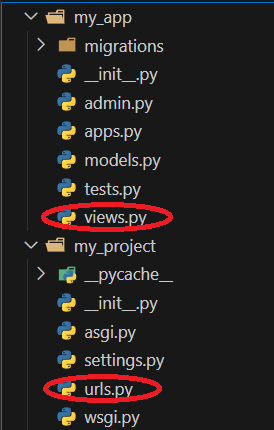|
  |:-:|

</p>

Now in the `views.py` file we can add methods using the request object, this
object is an indispensable tool for creating dynamic and functional views in
Django, it allow us to access to the information about the request, customize
our response, and make decisions about he view logic.
Don't forget to import and use the HttpResponse object since this will be
responsible for loading the appropiate view for the request.

```py
from django.http import HttpResponse

def hello(request):
    return HttpResponse("<h1>Hello World!</h1>")
```
Wwll now that we have created the method and so that it can be sent as a
response to a client request we must, import the method and assing it to a
route in the file `urls.py`, for this example it will be the default or main
route "".

```py
from my_app import views


urlpatterns = [
    path('admin/', admin.site.urls),
    path('', views.hello),
    path('about/', views.about)
]
```
### Hello World flowchart

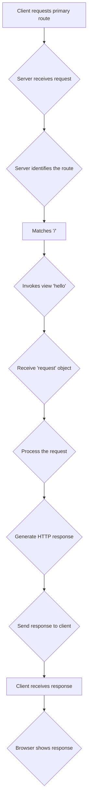

### Reorganizing

Well, we have already learned o create our responses, at least in a basic way,
now we have to think about possibly having more applications within the 
project, which would make the list of routes very extensive, to avoid that,
we have to reorganize the views and we can do this within our app's own folder,
in fact this is what Django suggests, make the applications contain their own 
urls to simply import them and bring all the views.

In order to do this we need to also import the `include` method, this method
allows us to include routes from another url module, maing reorganization
possible and easy.


`my_project/urls.py`
```py
from django.contrib import admin
from django.urls import path, include


urlpatterns = [
    path('admin/', admin.site.urls),
    path('', include('my_app.urls'))
]
```
`my_app/urls.py`
```py
from django.urls import path
from . import views

urlpatterns = [
    path('', views.hello),
    path('about/', views.about),
]
```


# Django - SQLite

In this section we will learn how to interact with the SQLiite database, as
well as the creation of tables from the models and their defalt tables.

In order to have access to the tables that come by default in Django we have
to execute the following commands:

```bash
venvnivek@YEFF:~/django_basics$ python3 manage.py makemigrations
```
```bash
venvnivek@YEFF:~/django_basics$ python3 manage.py migrate
```

Once these commands have been executed, we can see that our SQLite database
file now conains tables with differently composed structures.

certainly, we can't observe the content of the database file, so I recommend
to use a vscode extension called SQLite by alexcvzz.

Now from the vscode command palette or by pressing F1, we can access the SQLite
explorer, allowing us to have a view of its content.

<p>

  | 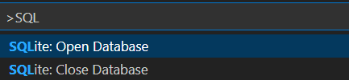 | 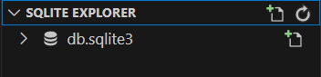 |
  |:---:|:---:|

</p>

Go ahead and take a look at your database file with the explorer.

<p align="center">
  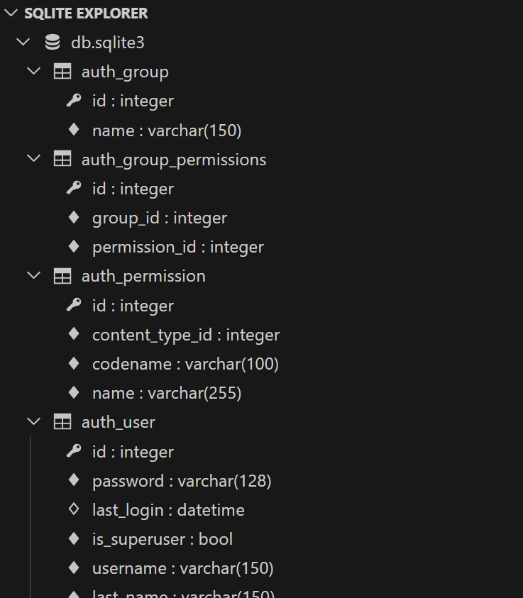
</p>

## How to create our own tables?

Well we have already learned to use or interact with the tables that come with
Django by default, it is true that these tables are a nice help.
Naturally the project will advance and the possibility of generatig more tables
for different types of categories will become a reality, so in order to create 
our own tables, what we must take into account are the `models.py` of our app
and the `settings.py` of our project.

The first of these files will be used to create models, these will be the 
representation of the tables for the database and the second file will be used
to connect the application models with the project and thus be able to carry
out the migrations satisfactorily

Create the model in `my_app/models.py`
```py
from django.db import models

# Create your models here.
class Project(models.Model):
  name = models.CharField(max_length=200)
```

Connect the model in `my_project/settings.py`
```py
# Application definition

INSTALLED_APPS = [
    'django.contrib.admin',
    'django.contrib.auth',
    'django.contrib.contenttypes',
    'django.contrib.sessions',
    'django.contrib.messages',
    'django.contrib.staticfiles',
    'my_app'
]
```
Once we have created and configured the model to represent tables in the
database, we have to run the migrations, this procedure will allow us to
see the able created within the database.

We can also specify the migrations we want to do, that is, which application
we want to do the migrations for.

```bash
venvnivek@YEFF:~/django_basics$ python3 manage.py makemigrations my_app
Migrations for 'my_app':
  my_app/migrations/0001_initial.py
    - Create model Project
venvnivek@YEFF:~/django_basics$ python3 manage.py migrate my_app
Operations to perform:
  Apply all migrations: admin, auth, contenttypes, my_app, sessions
Running migrations:
  Applying my_app.0001_initial... OK
```

<p align="center">

  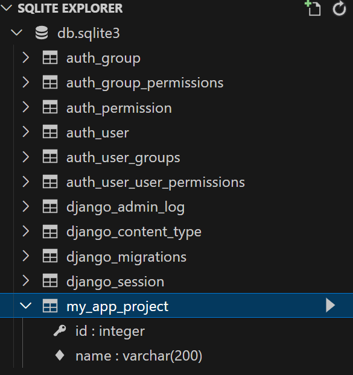

</p>


# Contact

<p align="center">
  
  <br>
  <a href="https://github.com/KevinYeff"><h>Kevin Espinoza</h></a>
</p>

<p align="center">
<a href="https://twitter.com/missingyeff" target="blank"></a>
<a href="https://www.linkedin.com/in/kevin-espinoza-salguedo-81a0a223b/" target="blank"></a>
<a href="https://github.com/KevinYeff" target="blank"></a>

</p>

